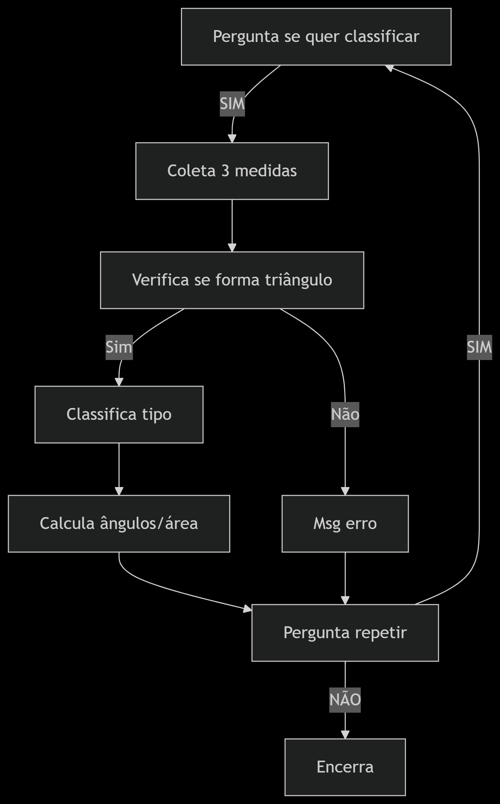
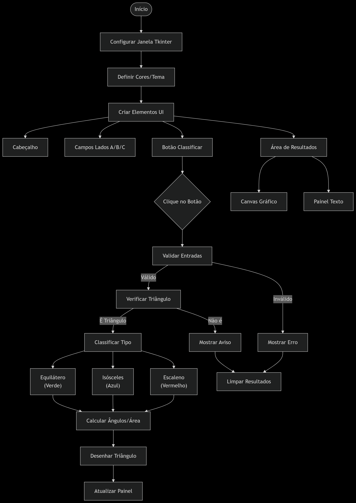

# GeoMath

## 🎯 Sobre o Projeto

Esse projeto foi feito com o intuito de classificar e exibir algumas informções de triângulos com base nas medidas de segmentos de reta apresentado pelos usuários.

###  ⚡ Sobre Mim:

Costumo buscar sempre proporcionar um ambiente de aprendizagem da forma mais didática possível, frequentemente utilizando o ASCE, meu robô educacional. No entanto, desta vez decidi ir além: explorei a ferramenta DeepSeek para desenvolver o front-end do meu projeto, que está integrado ao Thinker. Ainda assim, deixarei disponível também o projeto que desenvolvi de forma independente, sem auxílio externo. Pretendo continuar utilizando essa inteligência artificial enquanto aprimoro meus conhecimentos em front-end com Python.

###  📌 Desafios e Aprendizados:

Durante o desenvolvimento do projeto, revisitei importantes conceitos relacionados à formação de triângulos, ao mesmo tempo em que ampliei meu raciocínio lógico e minha capacidade analítica. O principal desafio, até o momento, tem sido a construção do front-end sem auxílios externos. No entanto, estou comprometido em superar essa dificuldade por meio de estudos contínuos, com o objetivo de aprimorar minhas habilidades e alcançar um desenvolvimento mais completo.

###  🔮 O Que Vem Por Aí:

Além de aprender a desenvolver o front-end dos meus projetos, pretendo também gerar executáveis (.exe) com ícone personalizado, com o objetivo de facilitar o uso e dispensar a necessidade de uma IDE instalada na máquina do usuário. Paralelamente, planejo desenvolver uma versão mobile, tornando a aplicação ainda mais acessível e versátil.

###  🔍 Observações Importantes:

Ressalto que a versão com front-end foi desenvolvida com auxílio externo, uma vez que ainda estou em processo de aprendizado nessa área do desenvolvimento em Python. A versão principal do projeto continua sendo a executada via terminal, utilizando o ASCE de forma semelhante a uma conversa em um chat, como no WhatsApp.

## 🗒️✏️ Tabela de Conteúdos

- [Arquitetura](#arquitetura)
- [Features](#features)
- [Contribua com o Projeto](#contribua-com-o-projeto)
- [Extra](#extra)
  
## **Arquitetura**

## Segue as informções descritivas sobre a versão sem front-end:

### Fluxograma de funcionamento:
```text

START
  │
  ├─ Exibe título artístico
  │
  ├─ Interação ASCE:
  │   ├─ Pausa dramática
  │   ├─ Pergunta nome → Resposta personalizada
  │   └─ Checa emoção → Frase de acordo com a resposta
  │
  └─ LOOP PRINCIPAL:
      ├─ Oferece classificação? → Valida resposta
      │
      ├─ COLETA LADOS (3x):
      │   ├─ Input → Valida se número positivo
      │   └─ Repete até válido
      │
      ├─ VERIFICA TRIÂNGULO:
      │   ├─ Se válido → Classifica
      │   │   ├─ Equilátero/Isósceles/Escaleno
      │   │   ├─ Calcula ângulos (Lei Cossenos)
      │   │   └─ Calcula área (Heron)
      │   └─ Se inválido → Mensagem
      │
      └─ REPETIR?
          ├─ Sim → Reinicia loop
          └─ Não → Mensagem despedida → END
```

### Diagrama de funcionamento



### Funcionamento do código

```python
# Bibliotecas usadas
import time       # Para pausas controladas (time.sleep)
import random     # Para seleção aleatória de frases
from datetime import datetime  # Não utilizado no código atual
import math       # Para cálculos matemáticos (math.acos, math.sqrt)

# Estética - Formatação visual do terminal
print('{:=^40}'.format('Desafio 42'))  # Centraliza o título com bordas de '='
print('{:80}'.format(40 * '='))        # Cria linha divisória de 80 caracteres

# Interação inicial com o usuário
input('')  # Pausa dramática (espera Enter)
nome = input('Olaaaa!!!!! Eu me chamo ASCE, como é seu nome? ').strip().upper()
# strip() remove espaços extras, upper() padroniza para maiúsculas

# Saudação personalizada baseada no nome
if nome in ['LUIS', 'LUÍS']:
    print('É bom te ver de novo carinha')  # Resposta para nomes específicos
elif nome in ['KAROL', 'ANE']:
    print('Fala guria!')
else:
    print('É um prazer te conhecer!!!!')  # Resposta padrão

# Banco de frases para respostas emocionais
frases_feliz = [  # Frases positivas
    'Se você está bem, eu estou bem!',
    'Que sua felicidade contagie a todos como me contagiou ;D',
    'Eu estou feliz por você estar feliz.',
    'Que bom que você está bem!'
]

frases_triste = [  # Frases motivacionais
    "Não desista, você é capaz de tudo!",
    "Cada desafio é uma oportunidade para crescer.",
    "Acredite em você, pois você tem muito potencial!",
    "Continue lutando, o sucesso está perto!"
]

# Verificação do estado emocional
emocao = input('Você está bem? [Sim/Não] ').strip().upper()

# Validação da resposta (só aceita SIM/NÃO)
while emocao not in ['SIM', 'NÃO']:
    emocao = input('Eu sou meio binário, vai ter que escolher entre SIM e NÃO :D ').strip().upper()

# Resposta aleatória conforme o estado emocional
if emocao == 'SIM':
    print(random.choice(frases_feliz))  # Seleciona frase feliz aleatória
else:
    print(random.choice(frases_triste)) # Seleciona frase motivacional aleatória

time.sleep(2)  # Pausa de 2 segundos

# Função para cálculo de ângulos usando Lei dos Cossenos
def calcular_angulo(a, b, c):
    """
    Calcula o ângulo oposto ao lado 'a' usando:
    cos(A) = (b² + c² - a²) / (2bc)
    Retorna o ângulo em graus
    """
    return math.degrees(math.acos((b**2 + c**2 - a**2) / (2 * b * c)))

# Loop principal do programa
while True:
    # Oferece funcionalidade de classificação
    duvida = input('\nAprendi uma nova utilidade. Agora consigo classificar triângulos. Quer ver? [Sim/Não] ').strip().upper()

    # Validação da resposta
    while duvida not in ['SIM', 'NÃO', 'QUERO']:  # Aceita 3 variações
        duvida = input('Eu sou meio binário, vai ter que escolher entre SIM e NÃO :D ').strip().upper()

    if duvida in ['NÃO']:
        print('Ok, outro dia então...')
        break  # Encerra o programa
    
    print('\nVamos nessa!!!!')
    time.sleep(1)  # Pequena pausa dramática
    
    # Coleta e validação dos lados do triângulo
    lados = []
    for i in range(3):  # Para os 3 lados (A, B, C)
        while True:
            try:
                lado = float(input(f'\nDigite a medida do {i+1}º segmento: '))
                if lado <= 0:
                    print("⚠️ O valor deve ser positivo!")
                    continue
                lados.append(lado)
                break
            except ValueError:
                print('⚠️ Isso não parece com um número! Digite apenas números.')
    
    r1, r2, r3 = lados  # Desempacota os lados

    # Verificação da desigualdade triangular
    if (r1 + r2 > r3) and (r1 + r3 > r2) and (r2 + r3 > r1):
        # Classificação do triângulo
        if r1 == r2 == r3:
            print("\nOs segmentos formam um triângulo equilátero (todos os lados iguais).")
        elif r1 == r2 or r1 == r3 or r2 == r3:
            print("\nOs segmentos formam um triângulo isósceles (dois lados iguais).")
        else:
            print("\nOs segmentos formam um triângulo escaleno (todos os lados diferentes).")
        
        # Cálculo dos ângulos
        angulo_A = calcular_angulo(r1, r2, r3)  # Ângulo oposto ao lado r1
        angulo_B = calcular_angulo(r2, r1, r3)  # Ângulo oposto ao lado r2
        angulo_C = 180 - angulo_A - angulo_B    # Soma dos ângulos = 180°
        
        # Exibição dos ângulos
        print("\nÂngulos do triângulo:")
        print(f"• Ângulo oposto ao 1º lado: {angulo_A:.2f}°")
        print(f"• Ângulo oposto ao 2º lado: {angulo_B:.2f}°")
        print(f"• Ângulo oposto ao 3º lado: {angulo_C:.2f}°")
        
        # Cálculo da área usando Fórmula de Heron
        s = (r1 + r2 + r3) / 2  # Semi-perímetro
        area = math.sqrt(s * (s - r1) * (s - r2) * (s - r3))
        print(f"\nÁrea do triângulo: {area:.2f} unidades quadradas")
    
    else:
        print("\nOs segmentos NÃO PODEM formar um triângulo!")  # Mensagem de erro
    
    # Pergunta se deseja repetir
    replay = input('\nGostaria de tentar de novo? [Sim/Não]: ').strip().upper()

    # Validação da resposta
    while replay not in ['SIM', 'NÃO']:
        replay = input('Por favor, escolha entre Sim ou Não: ').strip().upper()

    if replay == 'NÃO':
        # Mensagem de despedida personalizada
        print('\nEspero ter sido útil a você! Até a próxima :D')
        print('{:=^80}'.format(''))  # Linha decorativa
        break  # Encerra o loop principal

    print('\nReiniciando o código...\n')
    time.sleep(2)  # Pausa antes de reiniciar
```

## Segue as informções descritivas sobre a versão com front-end:

### Fluxograma de funcionamento:

```text
┌───────────────────────────────────────────────────────────────────────┐
│                      INICIALIZAÇÃO DA APLICAÇÃO                       │
├───────────────────────────────────────────────────────────────────────┤
│ 1. Configura janela principal (900x700)                               │
│    - Define cores modernas e tema                                     │
│    - Configura fonte Montserrat (se disponível)                       │
└───────────────────────┬───────────────────────────────────────────────┘
                        ↓
┌───────────────────────┴───────────────────────────────────────────────┐
│ 2. SETUP DA INTERFACE GRÁFICA                                         │
│    ├─ Cabeçalho azul com título "GEOMATH"                             │
│    ├─ Frame de entrada com 3 campos (Lado A/B/C)                      │
│    ├─ Botão azul de classificação                                     │
│    └─ Área de resultados dividida em:                                 │
│        ├─ Canvas matplotlib (esquerda)                                │
│        └─ Painel de informações (direita)                             │
└───────────────────────┬───────────────────────────────────────────────┘
                        ↓
┌───────────────────────┴───────────────────────────────────────────────┐
│ 3. FLUXO PRINCIPAL (ao clicar no botão)                               │
│    │                                                                  │
│    ├─ a. VALIDAÇÃO:                                                   │
│    │     - Verifica se valores são números positivos                  │
│    │     - Checa desigualdade triangular                              │
│    │                                                                  │
│    ├─ b. CLASSIFICAÇÃO:                                               │
│    │     - Equilátero (3 lados iguais → Verde)                        │
│    │     - Isósceles (2 lados iguais → Azul-claro)                    │
│    │     - Escaleno (todos diferentes → Vermelho)                     │
│    │                                                                  │
│    ├─ c. CÁLCULOS:                                                    │
│    │     - Ângulos (Lei dos Cossenos)                                 │
│    │     - Área (Fórmula de Heron)                                    │
│    │     - Perímetro/Semiperímetro                                    │
│    │                                                                  │
│    └─ d. ATUALIZA UI:                                                 │
│         - Desenha triângulo no canvas                                 │
│         - Exibe resultados no painel                                  │
└───────────────────────────────────────────────────────────────────────┘
```

### Informações do Layout:

1. **INICIALIZAÇÃO**
   - Configura janela Tkinter (900x700)
   - Define paleta de cores modernas
   - Tenta carregar fonte Montserrat

2. **INTERFACE GRÁFICA**
   ```text
   ┌───────────────────────────────┐
   │          GEOMATH              │  ← Cabeçalho azul
   ├───────────────────────────────┤
   │ Lado A: [___________]         │
   │ Lado B: [___________]         │  ← Formulário branco
   │ Lado C: [___________]         │
   ├───────────────────────────────┤
   │ [ CLASSIFICAR O TRIÂNGULO ]   │  ← Botão azul
   ├───────────────────────────────┤
   │ ┌─────────────┐ ┌───────────┐ │
   │ │  Desenho    │ │ Resultados│ │  ← Área dividida
   │ │  Triângulo  │ │ Detalhados│ │
   │ └─────────────┘ └───────────┘ │
   └───────────────────────────────┘
   ```

3. **FLUXO DE CLASSIFICAÇÃO**
   - Valida → Classifica → Calcula → Atualiza UI
   ```text
   Sequência:
   [Entrada] → [Validação] → [Triângulo?] → [Tipo] → [Cálculos] → [Desenho]
         ↑          │              │
         └──[Erro]←┘       [Não é triângulo]
   ```
   
   ### Diagrama de funcionamento

   

   ```python
#### Importações de bibliotecas
import tkinter as tk                      # Para interface gráfica
from tkinter import ttk, messagebox       # Componentes modernos e caixas de diálogo
import math                               # Funções matemáticas
from matplotlib.backends.backend_tkagg import FigureCanvasTkAgg  # Integração gráfica
from matplotlib.figure import Figure      # Para criação de figuras
import matplotlib.pyplot as plt           # Para plotagem

class ModernTriangleApp:
    def __init__(self, root):
        self.root = root
        self.root.title("GeoMath - Classificador de Triângulos")  # Título da janela
        self.root.geometry("900x700")                             # Tamanho da janela
        self.root.configure(bg='#f8f9fa')                         # Cor de fundo
        
        # Configuração de estilo
        self.style = ttk.Style()
        self.style.theme_use('clam')  # Tema moderno para widgets
        
        # Cores modernas (paleta profissional)
        self.primary_color = '#4e73df'    # Azul primário
        self.secondary_color = '#2e59d9'  # Azul secundário
        self.accent_color = '#1cc88a'     # Verde para sucesso
        self.danger_color = '#e74a3b'     # Vermelho para erros
        self.light_bg = '#f8f9fc'         # Fundo claro
        self.dark_text = '#5a5c69'        # Texto escuro
        
        self.setup_ui()  # Chama a construção da interface
    
    def setup_ui(self):
        # Frame principal (container para todos os elementos)
        main_frame = tk.Frame(self.root, bg=self.light_bg)
        main_frame.pack(fill=tk.BOTH, expand=True, padx=20, pady=20)
        
        # Cabeçalho moderno com azul institucional
        header_frame = tk.Frame(main_frame, bg=self.primary_color)
        header_frame.pack(fill=tk.X, pady=(0, 20))
        
        # Título principal com fonte destacada
        tk.Label(header_frame, text="GEOMATH", font=('Montserrat', 24, 'bold'), 
                bg=self.primary_color, fg='white', padx=20, pady=15).pack()
        
        # Frame de entrada com borda sutil
        input_frame = tk.Frame(main_frame, bg='white', bd=0, 
                             highlightbackground='#dddfeb', highlightthickness=1)
        input_frame.pack(fill=tk.X, pady=(0, 20), padx=10)
        
        # Título da seção de entrada
        tk.Label(input_frame, text="Medidas dos lados", font=('Montserrat', 12, 'bold'), 
                bg='white', fg=self.dark_text).pack(pady=(15, 10))
        
        # Estilo dos campos de entrada (moderno e clean)
        entry_style = {
            'font': ('Montserrat', 11), 
            'bg': '#f8f9fc', 
            'bd': 1, 
            'relief': 'flat', 
            'highlightbackground': '#dddfeb',
            'highlightthickness': 1, 
            'highlightcolor': self.primary_color
        }
        
        # Criação dos campos para os 3 lados
        sides = ['A', 'B', 'C']
        self.entries = []  # Armazenará as referências dos campos
        for i, side in enumerate(sides):
            # Container para cada linha (label + input)
            row_frame = tk.Frame(input_frame, bg='white')
            row_frame.pack(fill=tk.X, padx=20, pady=5)
            
            # Label do lado
            tk.Label(row_frame, text=f"Lado {side}:", font=('Montserrat', 10), 
                    bg='white', fg=self.dark_text).pack(side=tk.LEFT, padx=(0, 10))
            
            # Campo de entrada
            entry = tk.Entry(row_frame, **entry_style)
            entry.pack(side=tk.RIGHT, fill=tk.X, expand=True, ipady=5)
            self.entries.append(entry)  # Guarda referência
        
        # Botão principal de ação
        btn_frame = tk.Frame(main_frame, bg=self.light_bg)
        btn_frame.pack(fill=tk.X, pady=(0, 20))
        
        self.calc_btn = tk.Button(
            btn_frame, 
            text="CLASSIFICAR O TRIÂNGULO", 
            font=('Montserrat', 11, 'bold'),
            bg=self.primary_color, 
            fg='white', 
            activebackground=self.secondary_color,
            relief='flat', 
            bd=0, 
            padx=20, 
            pady=10,
            command=self.classify_triangle  # Vincula à função de classificação
        )
        self.calc_btn.pack(fill=tk.X, ipady=8)  # Botão expansível
        
        # Área de resultados (dividida em gráfico + informações)
        result_frame = tk.Frame(main_frame, bg='white', bd=0,
                              highlightbackground='#dddfeb', highlightthickness=1)
        result_frame.pack(fill=tk.BOTH, expand=True, padx=10)
        
        # Canvas para o desenho do triângulo (esquerda)
        self.figure = Figure(figsize=(5, 4), dpi=100, facecolor='white')
        self.canvas = FigureCanvasTkAgg(self.figure, master=result_frame)
        self.canvas.get_tk_widget().pack(side=tk.LEFT, fill=tk.BOTH, expand=True, padx=10, pady=10)
        
        # Painel de informações (direita)
        info_frame = tk.Frame(result_frame, bg='white')
        info_frame.pack(side=tk.RIGHT, fill=tk.BOTH, expand=True, padx=10, pady=10)
        
        # Frame de classificação (destaque)
        self.classification_frame = tk.Frame(info_frame, bg='#f8f9fc', bd=0,
                                           highlightbackground='#dddfeb', highlightthickness=1)
        self.classification_frame.pack(fill=tk.X, pady=(0, 15))
        
        # Label que mostrará o tipo de triângulo
        self.class_label = tk.Label(
            self.classification_frame, 
            text="", 
            font=('Montserrat', 14, 'bold'), 
            bg='#f8f9fc', 
            fg=self.primary_color,
            justify=tk.CENTER
        )
        self.class_label.pack(pady=15)
        
        # Área de detalhes (ângulos, área, etc.)
        details_frame = tk.Frame(info_frame, bg='white')
        details_frame.pack(fill=tk.BOTH, expand=True)
        
        self.details_label = tk.Label(
            details_frame, 
            text="", 
            font=('Montserrat', 10), 
            bg='white', 
            fg=self.dark_text,
            justify=tk.LEFT
        )
        self.details_label.pack(fill=tk.BOTH, expand=True, padx=10)
    
    def classify_triangle(self):
        try:
            # Obtém valores dos campos e converte para float
            a, b, c = [float(entry.get()) for entry in self.entries]
            
            # Valida se os valores são positivos
            if a <= 0 or b <= 0 or c <= 0:
                messagebox.showerror("Erro", "Todos os lados devem ser valores positivos!")
                return
            
            # Verifica desigualdade triangular
            if not (a + b > c and a + c > b and b + c > a):
                messagebox.showwarning("Aviso", "Estas medidas não formam um triângulo!")
                self.clear_results()
                return
            
            # Função interna para cálculo de ângulos
            def calculate_angle(x, y, z):
                # Lei dos Cossenos: ângulo oposto ao lado x
                return math.degrees(math.acos((y**2 + z**2 - x**2) / (2 * y * z)))
            
            # Calcula os três ângulos
            angle_A = calculate_angle(a, b, c)  # Ângulo oposto ao lado a
            angle_B = calculate_angle(b, a, c)  # Ângulo oposto ao lado b
            angle_C = 180 - angle_A - angle_B   # Soma dos ângulos = 180°
            
            # Calcula área usando Fórmula de Heron
            s = (a + b + c) / 2  # Semi-perímetro
            area = math.sqrt(s * (s - a) * (s - b) * (s - c))
            
            # Determina o tipo de triângulo e cores correspondentes
            if a == b == c:
                triangle_type = "EQUILÁTERO"
                type_explanation = "Todos os três lados são iguais"
                color = self.accent_color  # Verde
            elif a == b or a == c or b == c:
                triangle_type = "ISÓSCELES"
                type_explanation = "Dois lados são iguais"
                color = '#36b9cc'  # Azul claro
            else:
                triangle_type = "ESCALENO"
                type_explanation = "Todos os lados são diferentes"
                color = self.danger_color  # Vermelho
            
            # Atualiza a exibição da classificação
            self.class_label.config(
                text=f"Triângulo {triangle_type}\n{type_explanation}",
                fg=color  # Cor dinâmica conforme o tipo
            )
            
            # Desenha o triângulo no canvas
            self.draw_triangle(a, b, c, angle_A, angle_B, angle_C, color)
            
            # Prepara texto detalhado com medidas
            details_text = (
                f"Ângulos:\n"
                f"• Op. a Lado A: {angle_A:.2f}°\n"
                f"• Op. a Lado B: {angle_B:.2f}°\n"
                f"• Op. a Lado C: {angle_C:.2f}°\n\n"
                f"Medidas:\n"
                f"• Área: {area:.2f} u²\n"
                f"• Perímetro: {a+b+c:.2f} u\n"
                f"• Semi-perímetro: {s:.2f} u"
            )
            self.details_label.config(text=details_text)
            
        except ValueError:  # Captura entradas não numéricas
            messagebox.showerror("Erro", "Por favor, insira valores numéricos válidos!")
            self.clear_results()
    
    def draw_triangle(self, a, b, c, angle_A, angle_B, angle_C, color):
        """Desenha o triângulo com matplotlib baseado nas medidas"""
        self.figure.clear()  # Limpa o gráfico anterior
        ax = self.figure.add_subplot(111, facecolor='white')
        
        # Calcula coordenadas dos vértices:
        # - Lado a na base (0,0) até (c,0)
        # - Terceiro vértice calculado com trigonometria
        x = [0, c, b * math.cos(math.radians(angle_A))]
        y = [0, 0, b * math.sin(math.radians(angle_A))]
        
        # Cria polígono do triângulo
        triangle = plt.Polygon(
            list(zip(x, y)), 
            closed=True, 
            fill=True, 
            color=color, 
            alpha=0.3,  # Transparência
            ec='#2c3e50',  # Cor da borda
            lw=1.5  # Espessura da linha
        )
        ax.add_patch(triangle)
        
        # Rótulos dos lados (posicionados no meio de cada lado)
        ax.text((x[0]+x[1])/2, (y[0]+y[1])/2 - 0.05*max(y), f"{c:.1f}", 
                ha='center', va='top', fontsize=10, color=self.dark_text)
        ax.text((x[0]+x[2])/2 - 0.05*max(x), (y[0]+y[2])/2, f"{b:.1f}", 
                ha='right', va='center', fontsize=10, color=self.dark_text)
        ax.text((x[1]+x[2])/2 + 0.05*max(x), (y[1]+y[2])/2, f"{a:.1f}", 
                ha='left', va='center', fontsize=10, color=self.dark_text)
        
        # Rótulos dos ângulos (próximos aos vértices)
        ax.text(x[0] + 0.1*a, y[0] + 0.1*max(y), f"{angle_A:.1f}°", 
                ha='center', va='bottom', fontsize=9, color=self.primary_color)
        ax.text(x[1] - 0.1*a, y[1] + 0.1*max(y), f"{angle_B:.1f}°", 
                ha='center', va='bottom', fontsize=9, color=self.primary_color)
        ax.text(x[2], y[2] - 0.1*max(y), f"{angle_C:.1f}°", 
                ha='center', va='top', fontsize=9, color=self.primary_color)
        
        # Configurações do gráfico
        ax.set_aspect('equal')  # Mantém proporções
        margin = max(a, b, c) * 0.2  # Margem dinâmica
        ax.set_xlim(min(x)-margin, max(x)+margin)
        ax.set_ylim(min(y)-margin, max(y)+margin)
        ax.axis('off')  # Remove eixos
        
        self.canvas.draw()  # Renderiza o desenho
    
    def clear_results(self):
        """Limpa todos os resultados exibidos"""
        self.figure.clear()
        self.canvas.draw()
        self.class_label.config(text="")
        self.details_label.config(text="")

#### Ponto de entrada do programa
if __name__ == "__main__":
    root = tk.Tk()  # Cria a janela principal
    
    # Tenta configurar a fonte Montserrat (se disponível no sistema)
    try:
        from tkinter import font
        font.nametofont("TkDefaultFont").configure(family="Montserrat")
    except:
        pass  # Usa fonte padrão se Montserrat não estiver disponível
    
    app = ModernTriangleApp(root)  # Instancia a aplicação
    root.mainloop()  # Inicia o loop de eventos

## **Features**

- **Interface Moderna**: Design limpo com paleta de cores profissionais
- **Cálculos Precisos**: 
  - Classificação automática de triângulos
  - Ângulos exatos via Lei dos Cossenos
  - Área calculada pela Fórmula de Heron
- **Visualização Gráfica**: Desenho proporcional do triângulo

 ## **Contribua com o projeto**

Ele está disponível para versionamento, e caso você tenha alguma idéia legal, ou tenha criado uma versão melhor entre em [contato](https://meu-site-livid-two.vercel.app/), para assim eu divulgar sua versão com o seus créditos.

## **Extra**

Eu espero ter te ajudado de alguma forma, tenha um bom dia, ou tarde, ou noite ou madrugada (prefiro codar de madrugada). 

